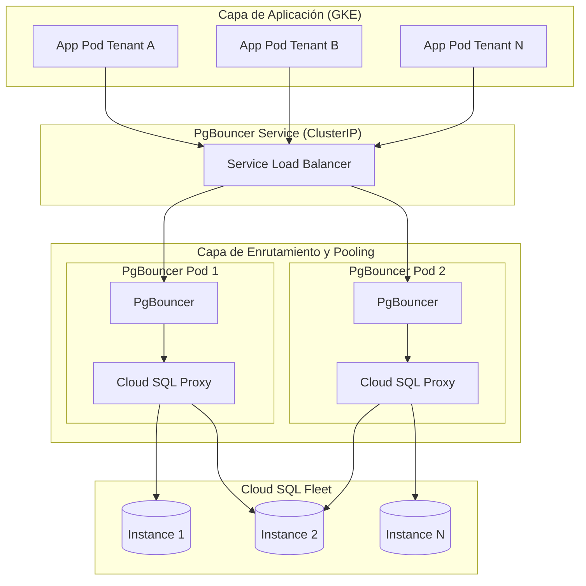

# 🏗️ Arquitectura Multi-Tenant - UniPark (GKE + PgBouncer + Cloud SQL)

## 📊 Diagrama de Arquitectura

---

## 🧩 Descripción

### 🔹 Aplicación
- Microservicios en GKE
- Conexión única a PgBouncer
- Multi-tenant por `dbname`

### 🔹 PgBouncer
- Pooling de conexiones
- Enrutamiento dinámico
- Alta disponibilidad con múltiples réplicas

### 🔹 Cloud SQL Proxy
- Autenticación segura (Workload Identity)
- Túneles TLS

### 🔹 Cloud SQL
- Instancias HA (Primary/Replica)
- Escalabilidad horizontal

---

## 🔐 Seguridad

- Zero Trust
- Sin IPs públicas
- mTLS automático
- IAM dinámico

---

## ⚡ Beneficios

- Escalabilidad transparente
- Alta disponibilidad
- Seguridad enterprise

---

## 🚀 Tecnologías

- GKE
- PgBouncer
- Cloud SQL
- Terraform
- Cloud Build
- Artifact Registry
- Monitoring

---

## 🧠 Nota

Este diagrama usa Mermaid y es compatible con GitHub.
